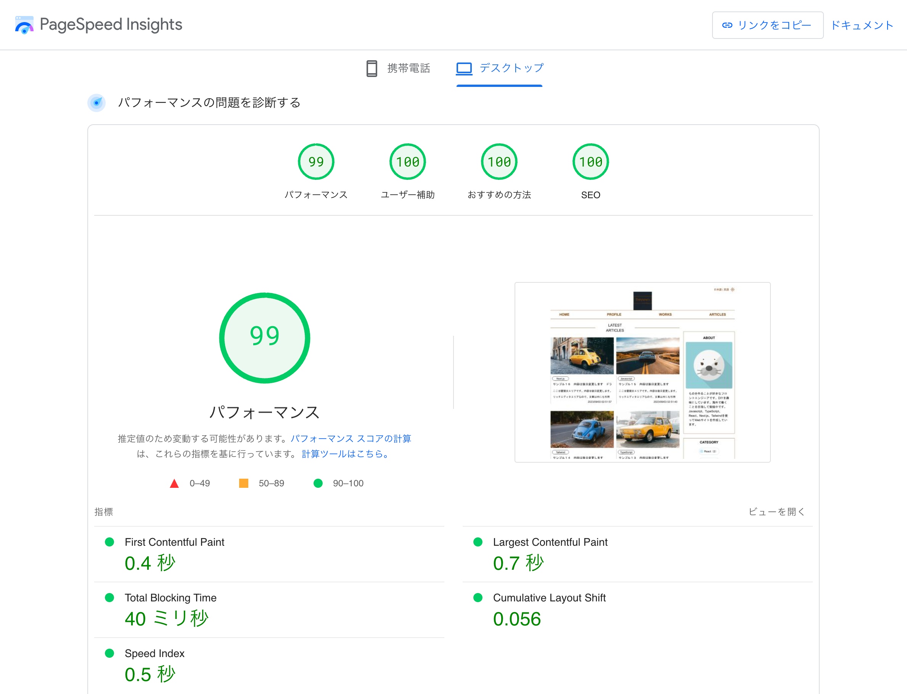

## <u>シンプルブログ</u>

##### <概要>
Next.jsで作成したシンプルなブログです。
Next.jsでwebサイトを一から作成したいと思い作成しました。
バックエンドにはmicroCMS（ヘッドレスCMS）を採用しています。  
[URL]: https://tech-blog-pink.vercel.app/ja

##### <製作日>

2023年10月（制作期間：約2ヶ月）

##### <仕様>

- バックエンド：microCMS（ヘッドレスCMS）
- 言語切替（日、英）
- ダークモード
- カテゴリ別・月別表示
- プレビュー機能
- レスポンシブ対応

##### <使用技術>

Next.js13(app router), microCMS, i18next, next-themes, highlight.js, tailwind, typescript,lucide-react etc

##### <パフォーマンス>

##### <参考URL>

<大枠>

- [Next.js 13 app directory で記事投稿サイトを作ってみよう（Zenn）](https://zenn.dev/azukiazusa/articles/next-js-app-dir-tutorial)
- [microCMS × Next.js（TypeScript）で個人ブログを作る（Qiita）](https://qiita.com/hinako_n/items/e53b02c241b8e35d42cb)
- [microCMS + Next.jsでJamstackブログを作ってみよう(microCMS公式ブログ)](https://blog.microcms.io/microcms-next-jamstack-blog/)

<月別アーカイブ>

- [Next.jsで月別アーカイブを実装してみよう(microCMS公式ブログ)](https://blog.microcms.io/monthly-archive/)

<ページネーション>

- [Next.js(SSG)でページネーションを実装してみよう(microCMS公式ブログ)](https://blog.microcms.io/next-pagination/)
- [Next.js, microCMS, Chakra UIで作るブログ　④ページネーションの設置(個人ブログ)](https://qlitre-weblog.comnext-microcms-blog-w-chakra-pagination#google_vignette)
- [microCMSとNext.jsでのカテゴリーごとのページネーション(個人ブログ)](https://www.komosyu.dev/posts/26)

<プレビューモード>

- [App RouterでmicroCMSのプレビューを表示する方法（Zenn）](https://zenn.dev/temasaguru/articles/716c10cab1992e)

<microCMS繰り返しフィールドの実装>

- [microCMS + Next.jsで、記事ページ内に投稿済み記事ページのリンクをリッチに埋め込む（Zenn）](https://zenn.dev/ebifran/articles/b3f988ccc43191)

<コードブロック>

- [html-react-parser × highlight.jsでコードブロックをハイライト(個人ブログ)](https://www.wadeen.net/posts/1s-m8k9rz)
- [microCMS + React に highlight.js を適用させたときの話（Qiita）](https://qiita.com/nami_73/items/3800a89aa922f6f0bc89)

<日英変換機能>

- [microCMSで多言語サイトに対応する方法(microCMS公式ブログ)](https://blog.microcms.io/microcms-multilingual-site/)
- [Next.js 13 アプリケーションをi18n多言語対応にする方法(個人ブログ)](https://logsuke.com/web/programming/react/next-i18n)
- [i18n with Next.js 13 and app directory(個人ブログ)](https://dev.to/adrai/i18n-with-nextjs-13-and-app-directory-18dm)
- [Next.js + markdown の多言語対応(個人ブログ)](https://chocolat5.com/tips/nextjs-markdown-blog-multi-languages/)

<middlewareを使ったredirect>

- [middlewareの再入門（matcher、条件分岐、rewrite、redirect）（Zenn）](https://zenn.dev/hayato94087/articles/ec16174696a375)
- [Next.jsで複数のmiddlewareの関数を連結させる（Zenn）](https://zenn.dev/hayato94087/articles/8f6496e0b8936f)

<ダークモード>

- [next-themes](https://github.com/pacocoursey/next-themes)

<パフォーマンス改善>
- [bundle size調べてみた](https://www.mitsuru-takahashi.net/blog/bundle-analyze/)
- [Next.jsで作ったブログのパフォーマンス改善](https://t-yng.jp/post/nextjs-perf-improvement)
- [highlight.jsのバンドルサイズを最適化する](https://kitamago-dev.vercel.app/blog/oqgxtzx5wb8)
- [お前らのReactは遅い](https://qiita.com/teradonburi/items/5b8f79d26e1b319ac44f)
- [PageSpeed Insightsで100点満点の爆速サイト🚀にした話](https://qiita.com/nuko-suke/items/22702472543bfd3e585f)
- [CSS アニメーションについて深く知る](https://qiita.com/yuki153/items/9aac0e5c8d7230a7bbe2)
- [レンダリングの仕組みを知り、パフォーマンス向上に活かす](https://zenn.dev/kamy112/articles/2651aa92cc33fd)
- [Reactコンポーネントの再レンダリング条件検証](https://qiita.com/ckbys/items/14082104a5ff84ce1d7d)
- [Reactのprops drilling（バケツリレー）とhooksに我々はどう立ち向かっていけばよいのか](https://www.asobou.co.jp/blog/web/props-drilling)
- [Next.jsについて調べてみる](https://zenn.dev/yyykms123/scraps/60198bd05aac7bbace61)